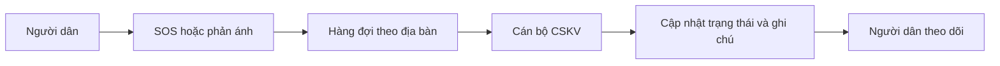
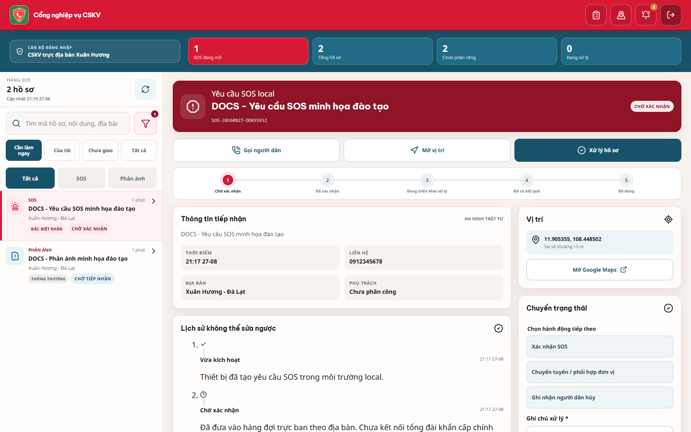
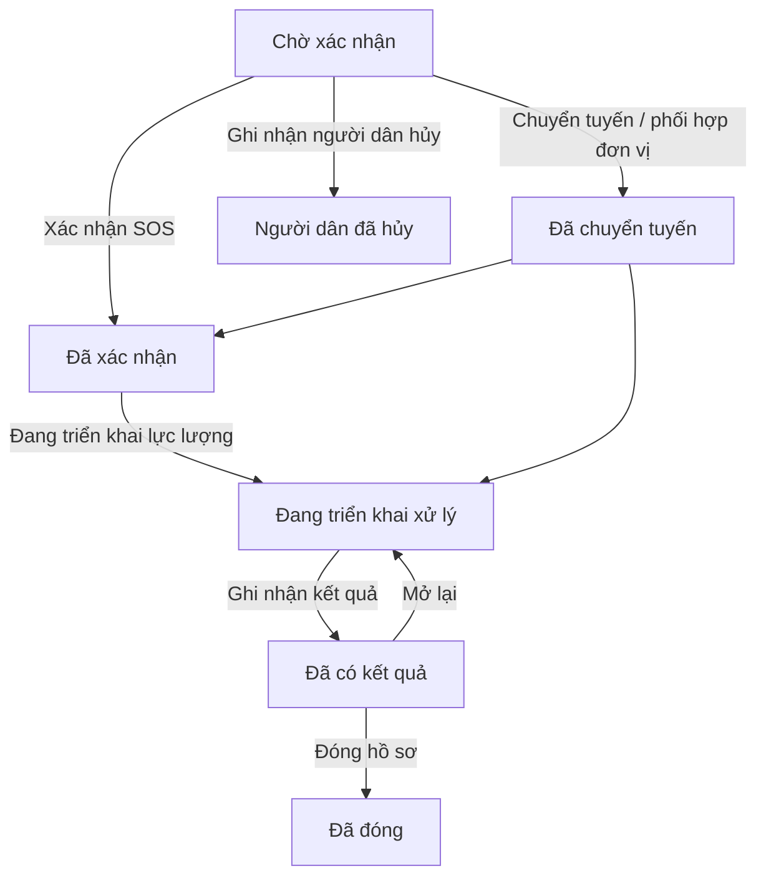
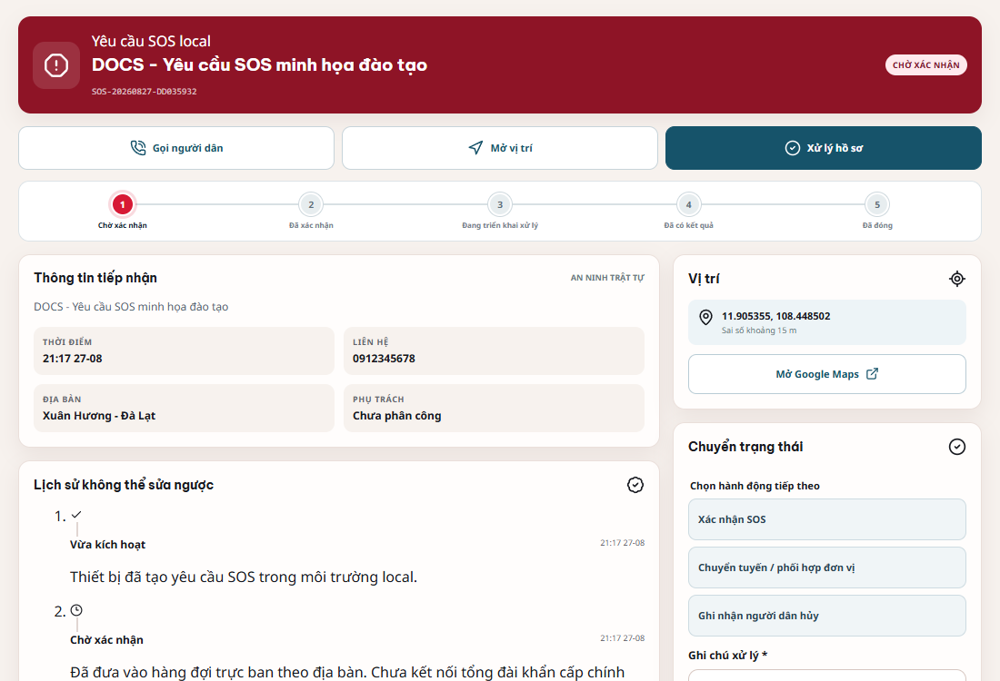
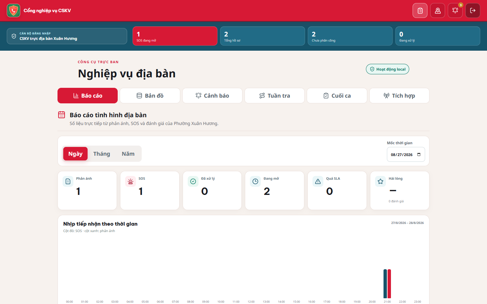

# TÀI LIỆU ĐÀO TẠO CÁN BỘ CSKV

**Thời lượng đề xuất:** 45–60 phút

**Đối tượng:** Cán bộ CSKV trực địa bàn trong giai đoạn pilot

**Mục tiêu:** Sau buổi học, học viên đăng nhập đúng địa bàn, ưu tiên hàng đợi, xử lý SOS/phản ánh đúng trạng thái và sử dụng các công cụ nghiệp vụ cơ bản.

> [!WARNING]
> Chỉ thực hành trên môi trường/dữ liệu đào tạo đã được phê duyệt. Không tạo SOS thử trên môi trường vận hành. SOS hiện là luồng local, chưa kết nối chính thức 112/113.

## Kế hoạch buổi đào tạo

| Phần | Nội dung | Thời lượng |
| --- | --- | ---: |
| 1 | Giới thiệu hệ thống và giới hạn pilot | 5 phút |
| 2 | Đăng nhập, bảo mật, kiểm tra địa bàn | 5 phút |
| 3 | Làm quen giao diện/hàng đợi/bản đồ | 8 phút |
| 4 | Xử lý SOS | 12 phút |
| 5 | Xử lý phản ánh | 10 phút |
| 6 | Tự nhận hồ sơ và phối hợp | 5 phút |
| 7 | Ghi nhận kết quả, đóng hồ sơ | 5 phút |
| 8 | Lỗi thường gặp | 5 phút |
| 9 | Thực hành và đánh giá | 10–20 phút |

## Phần 1 – Giới thiệu hệ thống

### Học viên cần nhớ

- Người dân gửi SOS/phản ánh kèm vị trí; hồ sơ được xếp vào địa bàn tương ứng.
- Cán bộ chỉ xem/xử lý dữ liệu thuộc địa bàn tài khoản.
- Mọi chuyển trạng thái có lịch sử không thể sửa ngược trong giao diện.
- Thông báo hiện ở trong website; chưa có SMS/Web Push.
- Tài khoản cán bộ chỉ tự nhận hồ sơ cho chính mình; chưa có điều phối giao cán bộ khác.
- Không có cổng Chỉ huy/Admin vận hành được trong phiên bản hiện tại.

## Phần 2 – Đăng nhập

### Thao tác mẫu

1. Mở địa chỉ hệ thống.
2. Chọn **Cán bộ Công an** hoặc **Đăng nhập CSKV**.
3. Nhập **Tên đăng nhập** và **Mật khẩu** được cấp.
4. Nhấn **Đăng nhập vào cổng CSKV**.
5. Kiểm tra tên cán bộ và địa bàn ở dòng **CÁN BỘ ĐĂNG NHẬP**.

### Kiểm tra đạt

- Đúng tên tài khoản.
- Đúng địa bàn.
- Thấy hàng đợi và chỉ số tổng quan.
- Không chia sẻ mật khẩu, không lưu mật khẩu trên máy dùng chung.

Phiên cán bộ khoảng 8 giờ. Khi hết phiên, đăng nhập lại; không nhấn gửi lại thao tác cũ trước khi kiểm tra hồ sơ.

## Phần 3 – Làm quen giao diện

### 3.1 Chỉ số tổng quan

Giảng viên giới thiệu **SOS đang mở**, **Tổng hồ sơ**, **Chưa phân công**, **Đang xử lý**. Chỉ số dùng để định hướng, nhưng quyết định xử lý phải dựa trên từng hồ sơ.

### 3.2 Hàng đợi

1. Chọn phạm vi **Cần làm ngay**, **Của tôi**, **Chưa giao** hoặc **Tất cả**.
2. Chọn loại **Tất cả**, **SOS** hoặc **Phản ánh**.
3. Dùng ô tìm theo mã, nội dung hoặc địa bàn.
4. Mở bộ lọc để sắp xếp ưu tiên/mới nhất/cũ nhất.
5. Nhấn thẻ hồ sơ để mở chi tiết.

Hàng đợi tự cập nhật khoảng 8 giây. Sau xung đột hoặc nghi ngờ dữ liệu cũ, nhấn **Tải lại hàng đợi**.

### 3.3 Chi tiết hồ sơ

Học viên phải xác định được:

- Mã và loại hồ sơ;
- trạng thái;
- thời gian;
- nội dung/nhóm;
- liên hệ nếu có;
- địa bàn và vị trí;
- người phụ trách;
- lịch sử;
- khu vực **Chuyển trạng thái**.

### 3.4 Bản đồ trực ban

Nhấn **Mở bản đồ trực ban**. Nhận biết điểm SOS, phản ánh và điểm nghiệp vụ. Dùng **Hiện hồ sơ kết thúc** khi cần đối chiếu lịch sử.

## Phần 4 – Xử lý SOS

### Quy trình chuẩn

### Thực hiện từng bước

1. Lọc **SOS** và **Cần làm ngay**.
2. Mở hồ sơ ưu tiên cao nhất.
3. Kiểm tra mã, thời gian, nhóm tình huống, vị trí/sai số và liên hệ.
4. Dùng **Gọi người dân** nếu cần xác minh; dùng **Mở vị trí** để xem Google Maps.
5. Chọn **Xác nhận SOS**; nhập ghi chú ít nhất 8 ký tự.
6. Chọn hoặc bỏ **Thông báo ghi chú này cho người dân** theo tính chất nội dung.
7. Nhấn **Xác nhận chuyển trạng thái**.
8. Tự nhận hồ sơ cho mình qua **Xử lý hồ sơ** nếu cần.
9. Chọn **Đang triển khai lực lượng** khi bắt đầu xử lý.
10. Khi có kết quả, chọn **Ghi nhận kết quả** và ghi ít nhất 20 ký tự.
11. Sau khi kiểm tra đầy đủ, chọn **Đóng hồ sơ**, ghi ít nhất 20 ký tự.

> [!IMPORTANT]
> Không có trạng thái “đã đến hiện trường” trong hệ thống. Không nói với học viên rằng GPS tự xác nhận cán bộ đã đến nơi.

## Phần 5 – Xử lý phản ánh

### Quy trình chuẩn

**Chờ tiếp nhận → Đã tiếp nhận → Đã phân công → Đang xác minh → Đang xử lý → Đã có kết quả → Đã đóng**

Nhánh ngoài phạm vi: **Đã tiếp nhận/Đang xác minh → Ngoài phạm vi → Đã đóng**.

### Thực hiện từng bước

1. Lọc **Phản ánh**, chọn hồ sơ.
2. Đọc nội dung và xem ảnh/video.
3. Kiểm tra điểm trên bản đồ và số liên hệ.
4. Chọn **Xác nhận tiếp nhận**.
5. Chọn **Phân công xử lý** để tự nhận.
6. Chọn **Bắt đầu xác minh**.
7. Dùng tin nhắn hoặc yêu cầu bổ sung ảnh nếu thiếu thông tin.
8. Thêm bằng chứng cán bộ khi phù hợp.
9. Chọn **Chuyển sang xử lý**.
10. Chọn **Ghi nhận kết quả** hoặc **Chuyển trạng thái ngoài phạm vi**; ghi ít nhất 20 ký tự.
11. Kiểm tra lịch sử rồi **Đóng hồ sơ**.

### Quy tắc ghi chú

Một ghi chú tốt trả lời: đã kiểm tra gì, căn cứ nào, đã làm gì, kết quả ra sao và bước tiếp theo là gì. Không ghi dữ liệu nhạy cảm vào phần công khai.

## Phần 6 – Tự nhận và phối hợp

Phiên bản pilot không có màn hình chọn cán bộ khác.

1. Mở hồ sơ chưa giao.
2. Nhấn **Xử lý hồ sơ**.
3. Tự nhận hồ sơ cho chính tài khoản đang đăng nhập.
4. Tải lại để kiểm tra người phụ trách.
5. Nếu cần đơn vị khác, dùng **Chuyển tuyến / phối hợp đơn vị** với SOS hoặc quy trình phối hợp ngoài hệ thống đã được đơn vị phê duyệt; ghi chú rõ.

Khi hai cán bộ thao tác đồng thời, cập nhật dựa trên trạng thái cũ có thể bị từ chối. Người nhận lỗi phải tải lại, đọc lịch sử và phối hợp, không cố gửi lặp.

## Phần 7 – Hoàn thành sự việc

### Trước khi ghi nhận kết quả

- Đúng mã hồ sơ và người phụ trách.
- Đủ bằng chứng/trao đổi cần thiết.
- Ghi chú kết quả từ 20 ký tự, rõ ràng và kiểm chứng được.
- Chọn đúng phạm vi công khai.

### Trước khi đóng

- Trạng thái đã là **Đã có kết quả** hoặc nhánh hợp lệ.
- Người dân đã nhận được thông tin cần công khai.
- Không còn yêu cầu bổ sung đang chờ.
- Ghi chú đóng từ 20 ký tự.

Hồ sơ **Đã có kết quả** có thể mở lại về xử lý. Hồ sơ **Đã đóng** không chuyển tiếp được.

## Phần 8 – Công cụ nghiệp vụ

- **Báo cáo:** xem theo Ngày/Tháng/Năm; đọc số phản ánh, SOS, đã xử lý, đang mở, quá SLA và hài lòng.
- **Bản đồ:** thêm/sửa/xóa điểm Công an, camera, điểm nguy cơ, chốt tuần tra, cơ sở công cộng trong địa bàn.
- **Cảnh báo:** nhập nội dung, mức rủi ro, thời hạn 2/4/8/24 giờ; nhấn **Phát hành cảnh báo**.
- **Tuần tra:** tạo phiên; **Bắt đầu**, **Check-in**, **Tạm dừng**, **Tiếp tục**, **Kết thúc**. Chỉ chủ phiên được cập nhật.
- **Cuối ca:** kiểm tra tổng hợp, nhập ghi chú, **Xác nhận báo cáo ca**.
- **Tích hợp:** VNeID, AI, Camera, SMS/Web Push/112/113 đang phát triển.

## Phần 9 – Các lỗi thường gặp

| Lỗi | Cách xử lý tại lớp/vận hành |
| --- | --- |
| Không đăng nhập | Kiểm tra tên/mật khẩu, trạng thái tài khoản; không chia sẻ mật khẩu |
| Sai địa bàn | Đăng xuất và báo đầu mối cấp tài khoản |
| Không thấy hồ sơ | Chọn **Tất cả**, bỏ bộ lọc, tải lại, kiểm tra địa bàn |
| Nút chuyển trạng thái bị khóa | Chọn hành động, nhập đủ 8/20 ký tự |
| Cập nhật bị từ chối | Tải lại vì trạng thái có thể đã thay đổi; đọc lịch sử |
| Không giao được người khác | Đây là giới hạn pilot; chỉ tự nhận |
| Không mở được bản đồ | Kiểm tra mạng, tải lại, thử trình duyệt khác |
| Không có thông báo ngoài trình duyệt | SMS/Web Push chưa hoạt động; mở cổng và kiểm tra hàng đợi |
| Dữ liệu/điểm không khớp | Không tự sửa hồ sơ; ghi lại mã/tọa độ và báo đầu mối dữ liệu |

## Phần 10 – Bài tập thực hành

### Bài 1 – Ưu tiên hàng đợi

Cho sẵn một SOS và ba phản ánh. Học viên phải dùng **Cần làm ngay**, bộ lọc **SOS** và sắp xếp **Ưu tiên** để chọn đúng hồ sơ trước, nhưng không chuyển trạng thái.

**Đạt khi:** chọn đúng hồ sơ, đọc được mã, địa bàn, vị trí và trạng thái.

### Bài 2 – Xử lý SOS trên dữ liệu đào tạo

Thực hiện: mở SOS → kiểm tra → **Xác nhận SOS** → tự nhận → **Đang triển khai lực lượng** → **Ghi nhận kết quả** → **Đóng hồ sơ**.

**Đạt khi:** đúng thứ tự, ghi chú đủ và không công khai dữ liệu nhạy cảm.

### Bài 3 – Xử lý phản ánh cần bổ sung ảnh

Thực hiện: tiếp nhận → phân công → xác minh → gửi yêu cầu bổ sung ảnh → xử lý → kết quả → đóng.

**Đạt khi:** người dân nhìn thấy yêu cầu bổ sung; lịch sử đầy đủ.

### Bài 4 – Phản ánh ngoài phạm vi

Chọn **Chuyển trạng thái ngoài phạm vi**, ghi lý do và hướng dẫn tối thiểu 20 ký tự, sau đó đóng.

**Đạt khi:** không dùng từ mơ hồ, có hướng dẫn người dân.

### Bài 5 – Xung đột thao tác

Hai học viên mở cùng một hồ sơ đào tạo. Một người cập nhật trước; người còn lại tải lại sau khi bị từ chối và giải thích lịch sử mới.

**Đạt khi:** không gửi lặp, không tìm cách sửa lịch sử, phối hợp rõ ràng.

## Phiếu đánh giá cuối buổi

- [ ] Đăng nhập và xác nhận đúng địa bàn.
- [ ] Lọc được SOS/phản ánh cần làm.
- [ ] Phân biệt các trạng thái thực tế.
- [ ] Tự nhận hồ sơ đúng chính sách pilot.
- [ ] Chuyển trạng thái đúng thứ tự.
- [ ] Ghi chú đúng độ dài và phạm vi công khai.
- [ ] Biết mở vị trí, liên hệ và lịch sử.
- [ ] Biết giới hạn 112/113, SMS/Web Push, AI, VNeID.
- [ ] Biết xử lý khi mạng lỗi hoặc có xung đột.
- [ ] Đăng xuất khi kết thúc.
