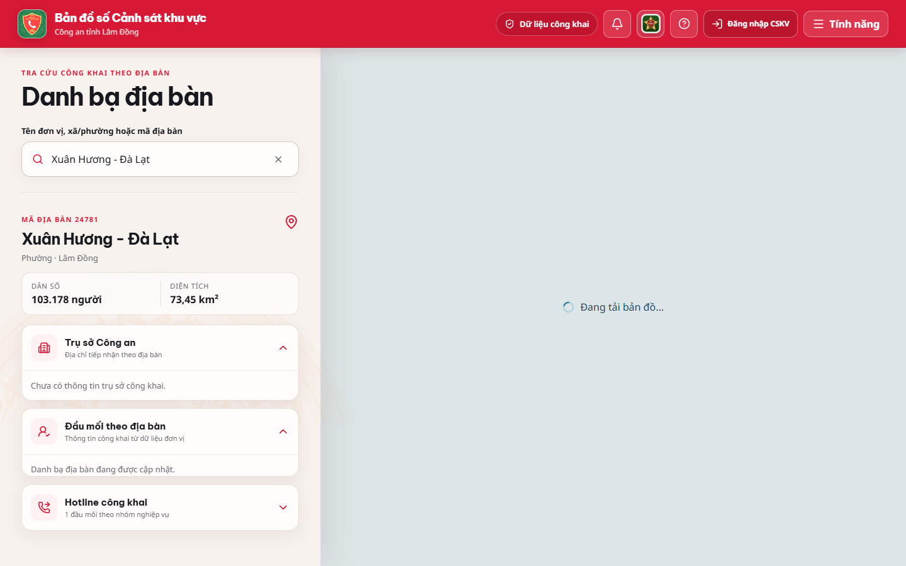
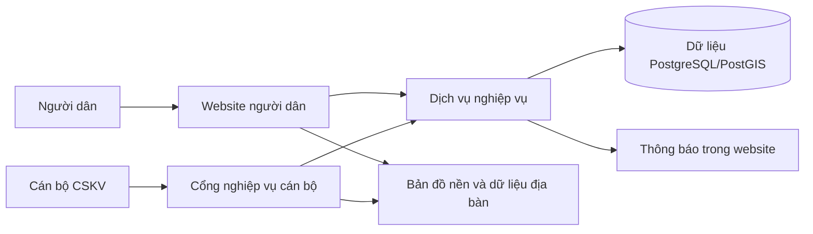
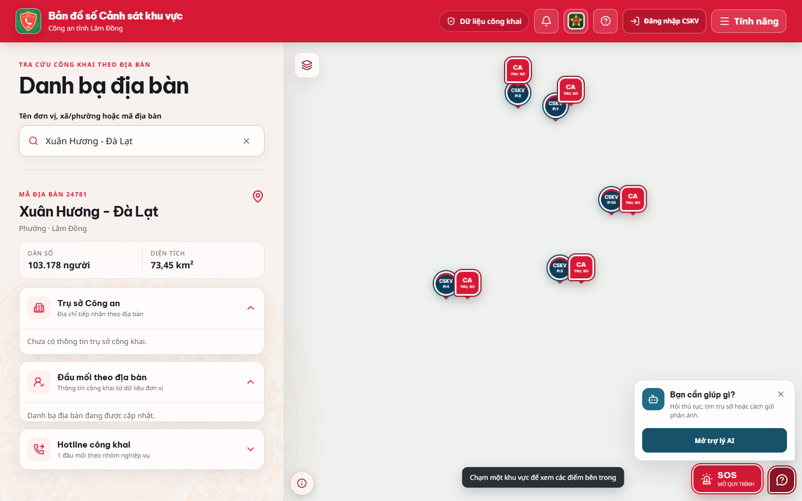
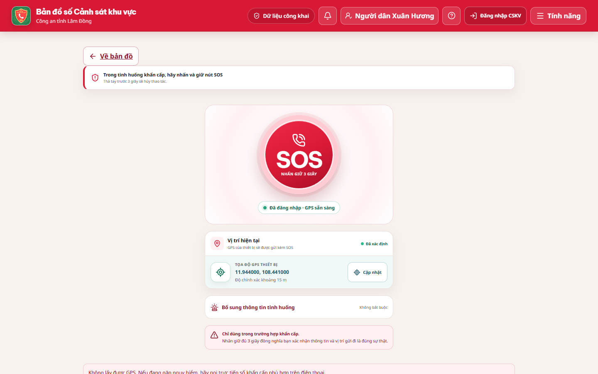
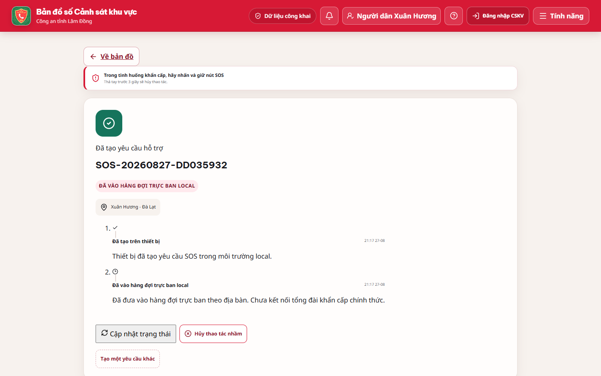
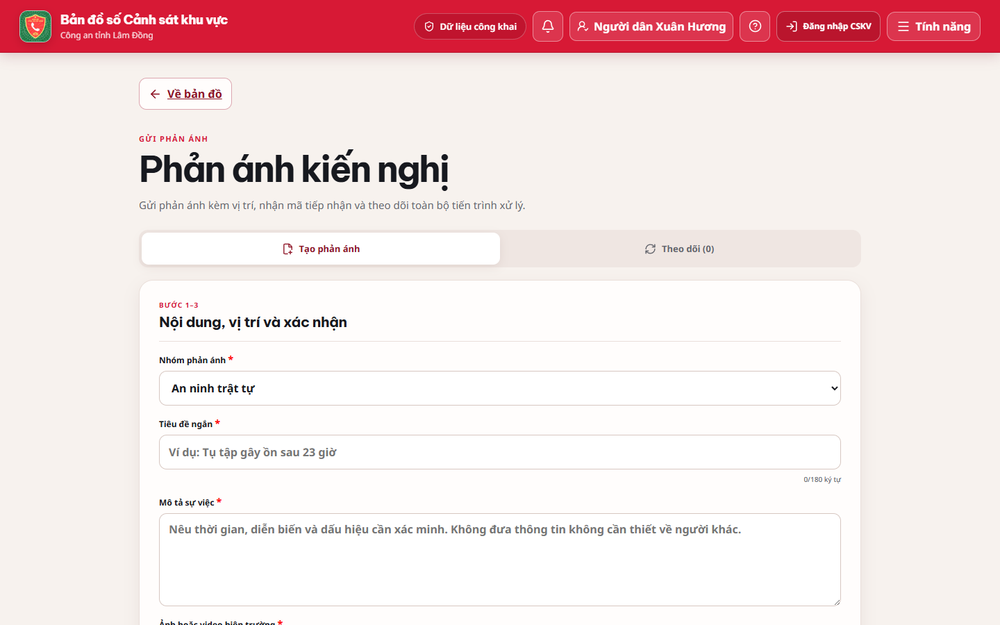
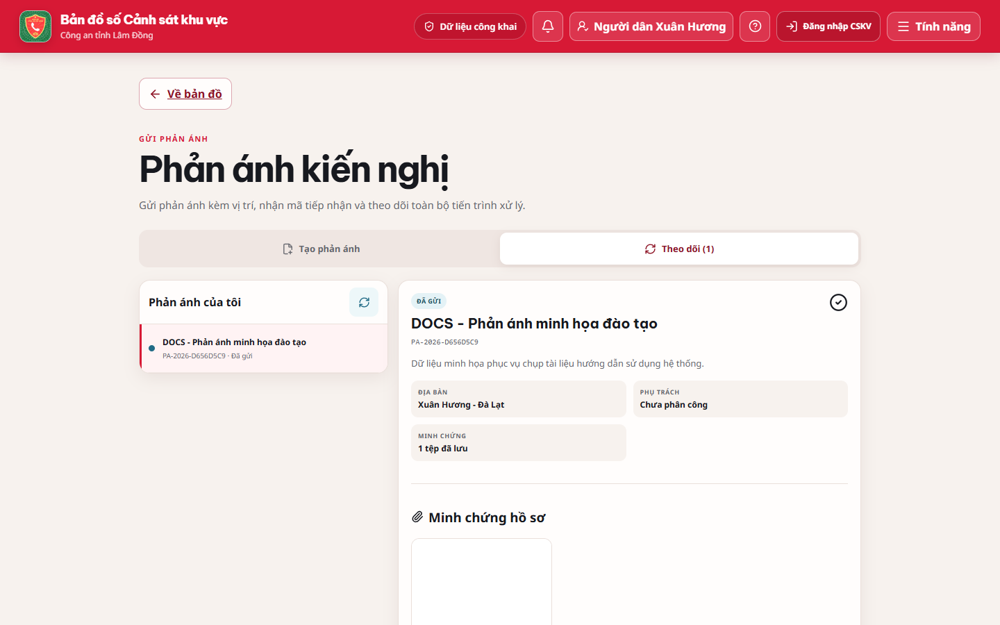
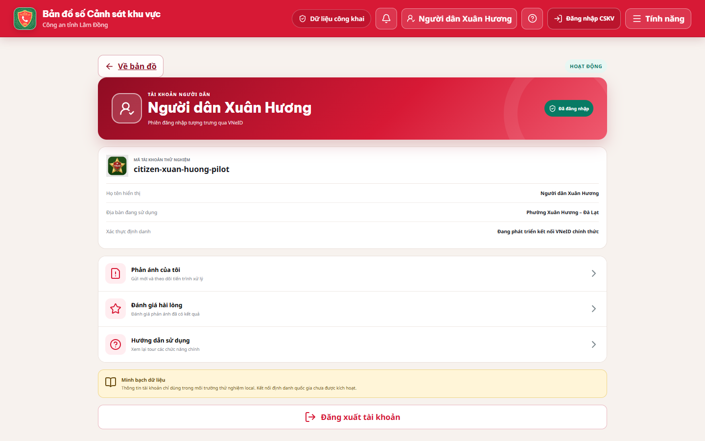
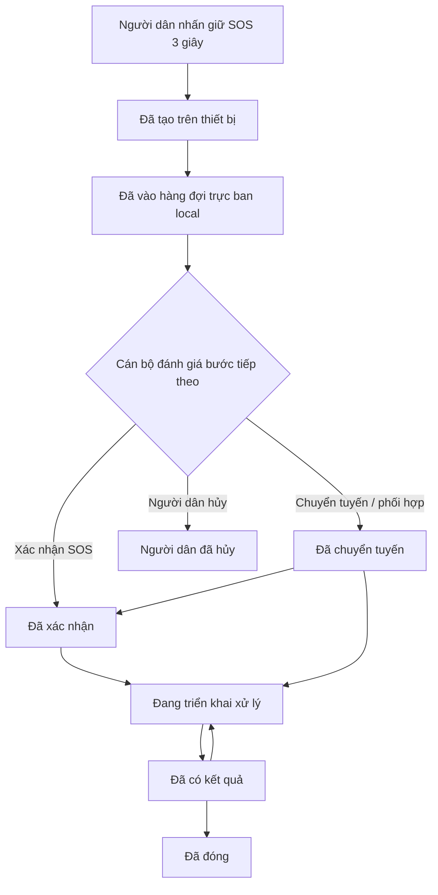

# HƯỚNG DẪN SỬ DỤNG HỆ THỐNG

**Phiên bản tài liệu:** 1.0

**Phạm vi:** Phiên bản pilot đang triển khai tại `http://42.96.15.215`

**Đối tượng:** Người dân và cán bộ Cảnh sát khu vực (CSKV)

> [!IMPORTANT]
> Tài liệu này mô tả đúng chức năng đã phát hiện trong phiên bản hiện tại. Hệ thống đang ở mức **pilot/local**: SOS được đưa vào hàng đợi trực ban trong hệ thống, **chưa kết nối chính thức với 112/113**; VNeID, AI, camera và SMS/Web Push chưa được tích hợp hoàn chỉnh.

## 1. Giới thiệu

Hệ thống hỗ trợ người dân tra cứu địa bàn, đơn vị Công an, cảnh báo công khai, gửi phản ánh và tạo yêu cầu SOS có vị trí. Cán bộ CSKV sử dụng một cổng nghiệp vụ riêng để xem hàng đợi, tiếp nhận và cập nhật tiến độ xử lý.

Hai nhóm người dùng thực tế đã được xác nhận:

- **Người dân:** xem bản đồ và danh bạ công khai; đăng nhập để gửi SOS, phản ánh, trao đổi, nhận thông báo và đánh giá.
- **Cán bộ CSKV:** đăng nhập cổng nghiệp vụ; xem hồ sơ thuộc địa bàn; tự nhận và xử lý hồ sơ; quản lý cảnh báo, tuần tra, điểm bản đồ, báo cáo và báo cáo cuối ca.

Không có màn hình quản trị viên, quản lý tài khoản, phân quyền hay quản lý đơn vị trong phiên bản hiện tại. Dữ liệu có nhãn “supervisor” trong cơ sở dữ liệu nhưng chưa có luồng đăng nhập và giao diện Chỉ huy sử dụng được.

Các thành phần chính gồm website người dân, cổng nghiệp vụ cán bộ, bản đồ số, dịch vụ xử lý nghiệp vụ và kho dữ liệu địa bàn.

## 2. Tổng quan hệ thống

Luồng tổng quát:

1. Người dân gửi SOS hoặc phản ánh kèm vị trí.
2. Hệ thống kiểm tra vị trí có thuộc địa bàn đang phục vụ hay không.
3. Hồ sơ xuất hiện trong hàng đợi của cán bộ địa bàn.
4. Cán bộ mở hồ sơ, tự nhận và cập nhật trạng thái theo luồng được phép.
5. Người dân theo dõi trạng thái và thông tin công khai trong website.

> [!NOTE]
> Ứng dụng Expo ở thư mục gốc của mã nguồn là một nhánh ứng dụng di động cũ/độc lập. Cổng pilot đang vận hành và được mô tả trong tài liệu này là website trong thư mục `platform`.

## 3. Hướng dẫn dành cho người dân

### 3.1 Truy cập ứng dụng

#### Sử dụng không cần đăng nhập

1. Mở trình duyệt Chrome, Edge hoặc Safari.
2. Truy cập địa chỉ hệ thống do đơn vị triển khai cung cấp.
3. Chọn **Người dân** nếu màn hình yêu cầu chọn vai trò.
4. Có thể xem **Bản đồ & danh bạ** và **Cảnh báo khu vực** ngay.

#### Đăng nhập

1. Nhấn **Đăng nhập VNeID** ở đầu màn hình hoặc mở **Tài khoản**.
2. Nhập số điện thoại và mật khẩu được cấp cho giai đoạn pilot.
3. Nhấn nút đăng nhập.
4. Kiểm tra tên/số điện thoại hiển thị ở màn hình **Tài khoản**.

> [!NOTE]
> Đây là đăng nhập mô phỏng phục vụ pilot, chưa phải tích hợp VNeID chính thức. Phiên người dân có thời hạn khoảng 12 giờ; hết thời hạn cần đăng nhập lại.

#### Cho phép vị trí

Khi trình duyệt hỏi quyền vị trí, chọn **Cho phép**. Hệ thống cần vị trí để tìm địa bàn, đặt điểm phản ánh và tạo SOS. Website không yêu cầu quyền micro. Ảnh/video được chọn từ thiết bị khi gửi phản ánh.

### 3.2 Làm quen với màn hình chính

| Nút/khu vực | Chức năng | Khi nào sử dụng |
| --- | --- | --- |
| **Bản đồ** | Hiển thị ranh địa bàn, đơn vị và điểm tham chiếu | Khi cần tìm địa bàn hoặc xem vị trí |
| Ô tìm kiếm | Tìm theo tên, đơn vị hoặc mã địa bàn | Khi đã biết một phần thông tin cần tìm |
| Nút vị trí | Xin vị trí hiện tại và đưa bản đồ về vị trí đó | Khi bản đồ đang ở nơi khác |
| **SOS** | Mở biểu mẫu yêu cầu trợ giúp khẩn cấp local | Chỉ dùng trong tình huống thực sự cần trợ giúp |
| **Tính năng** | Mở danh sách bản đồ, cảnh báo, phản ánh, đánh giá và trợ lý | Khi chuyển sang chức năng khác |
| **Thông báo** | Xem cập nhật của cán bộ đối với hồ sơ | Sau khi đã gửi phản ánh/SOS |
| **Hướng dẫn** | Mở tour giới thiệu các vị trí quan trọng | Lần đầu sử dụng hoặc cần xem lại |
| **Tài khoản** | Xem phiên đăng nhập, hồ sơ và đăng xuất | Khi quản lý thông tin cá nhân |

Trên điện thoại, thanh điều hướng dưới có bốn mục: **Bản đồ**, **Danh bạ**, **Phản ánh**, **Tài khoản**.

## 4. Hướng dẫn sử dụng bản đồ và danh bạ

### 4.1 Xem vị trí hiện tại

1. Mở **Bản đồ**.
2. Nhấn nút định vị trên bản đồ.
3. Chọn **Cho phép** nếu trình duyệt hỏi quyền.
4. Chờ hệ thống hiển thị vị trí và địa bàn tương ứng.

Nếu vị trí không xuất hiện, xem mục 19.1.

### 4.2 Di chuyển và phóng to bản đồ

1. Kéo bản đồ bằng một ngón tay hoặc chuột để di chuyển.
2. Chụm/mở hai ngón tay hoặc dùng nút `+`/`−` để phóng to, thu nhỏ.
3. Nhấn lại nút định vị để quay về vị trí hiện tại.

### 4.3 Tìm địa bàn hoặc đơn vị

1. Nhấn ô tìm kiếm.
2. Nhập tên địa bàn, đơn vị hoặc mã.
3. Chọn kết quả phù hợp.
4. Kiểm tra thẻ thông tin và điểm được chọn trên bản đồ.

### 4.4 Xem thông tin đơn vị hỗ trợ

1. Chọn một địa bàn hoặc điểm đơn vị trên bản đồ.
2. Xem tên đơn vị, địa chỉ và thông tin liên hệ công khai.
3. Nếu có số điện thoại, nhấn số để mở chức năng gọi của điện thoại.
4. Nếu có vị trí chính thức, nhấn liên kết chỉ đường để mở Google Maps.

> [!WARNING]
> Một số ranh, điểm CSKV, trạm và cảnh báo đang là dữ liệu demo/tham chiếu. Hãy kiểm tra tên đơn vị và thông tin công khai trước khi liên hệ.

### 4.5 Bật/tắt lớp dữ liệu

Trong công cụ lớp bản đồ, người dùng có thể bật/tắt ranh địa bàn, ranh 5 phường cũ, bán kính tham chiếu 3 km, điểm trạm/CSKV demo và cảnh báo demo. Thao tác này chỉ thay đổi nội dung hiển thị, không thay đổi dữ liệu.

## 5. Hướng dẫn sử dụng SOS

### 5.1 Khi nào nên sử dụng SOS

Các nhóm tình huống mà biểu mẫu hiện hỗ trợ:

- **Nguy cơ an ninh, trật tự**;
- **Tai nạn giao thông**;
- **Cháy, cứu nạn hoặc cứu hộ**;
- **Cấp cứu y tế**;
- **Tình huống nguy cấp khác**.

> [!WARNING]
> **Không sử dụng chức năng SOS để thử nghiệm, đùa giỡn hoặc gửi thông tin không đúng sự thật.** Phiên bản pilot chỉ đưa yêu cầu vào hàng đợi trực ban local, chưa thay thế các kênh khẩn cấp chính thức. Nếu có nguy hiểm tức thời mà hệ thống không phản hồi, hãy chủ động liên hệ số khẩn cấp phù hợp bằng điện thoại.

### 5.2 Điều kiện gửi SOS

- Người dân đã đăng nhập.
- Trình duyệt lấy được vị trí.
- Sai số vị trí không lớn hơn khoảng 1.000 m.
- Vị trí thuộc địa bàn hệ thống đang phục vụ.
- Có kết nối mạng tại thời điểm gửi.

### 5.3 Cách gửi SOS

#### Bước 1 – Mở SOS

Tại màn hình bản đồ, nhấn nút **SOS** nổi trên bản đồ. Nếu chưa đăng nhập, hoàn tất đăng nhập trước.

#### Bước 2 – Chờ lấy vị trí

Cho phép trình duyệt truy cập vị trí. Chờ hệ thống hiển thị tọa độ, độ chính xác và địa bàn.

#### Bước 3 – Chọn nhóm tình huống

Chọn một trong năm nhóm tình huống phù hợp nhất.

#### Bước 4 – Bổ sung thông tin

Nhập ghi chú ngắn nếu cần, tối đa 500 ký tự. Kiểm tra số điện thoại liên hệ nếu biểu mẫu hiển thị trường này.

#### Bước 5 – Nhấn và giữ 3 giây

Đặt ngón tay hoặc con trỏ vào nút gửi SOS, **giữ liên tục đủ 3 giây**. Thả ra trước khi đủ thời gian sẽ hủy thao tác, không gửi yêu cầu.

#### Bước 6 – Kiểm tra xác nhận

Sau khi gửi thành công, hệ thống hiển thị mã bắt đầu bằng `SOS-`, trạng thái, địa bàn, vị trí và lịch sử.

> [!IMPORTANT]
> Chỉ coi là gửi thành công khi thấy **mã SOS** và trang xác nhận. Không nhấn gửi lại chỉ vì chưa thấy cán bộ cập nhật ngay.

### 5.4 Sau khi gửi SOS

Người dân có thể:

1. Xem mã và trạng thái hiện tại.
2. Nhấn tải lại để cập nhật tiến độ.
3. Theo dõi các ghi chú mà cán bộ cho phép công khai.
4. Hủy yêu cầu khi trạng thái còn **Đã tạo trên thiết bị** hoặc **Đã vào hàng đợi trực ban local**; hệ thống sẽ yêu cầu xác nhận.
5. Tạo yêu cầu khác sau khi hoàn tất theo dõi, chỉ khi thực sự cần thiết.

Website không hiển thị tên cán bộ/đơn vị điều phối chính thức cho mọi giai đoạn và không tự mở cuộc gọi khẩn cấp.

### 5.5 Trạng thái SOS

| Trạng thái người dân thấy | Ý nghĩa | Người dân cần làm gì |
| --- | --- | --- |
| **Đã tạo trên thiết bị** | Yêu cầu vừa được tạo | Chờ hệ thống đưa vào hàng đợi; không gửi lặp |
| **Đã vào hàng đợi trực ban local** | Yêu cầu đã vào hệ thống pilot | Giữ điện thoại sẵn sàng, theo dõi cập nhật |
| **Cán bộ đã xác nhận tiếp nhận** | Cán bộ đã xác nhận hồ sơ | Bổ sung thông tin nếu được liên hệ |
| **Đang triển khai xử lý** | Cán bộ đang xử lý | Làm theo hướng dẫn an toàn của lực lượng chức năng |
| **Đã chuyển tuyến** | Hồ sơ đang được phối hợp/chuyển tuyến | Tiếp tục theo dõi thông báo |
| **Đã có kết quả** | Đã ghi nhận kết quả xử lý | Kiểm tra kết quả; phản hồi nếu được yêu cầu |
| **Đã đóng** | Hồ sơ kết thúc | Không cần thao tác thêm |
| **Người dân đã hủy** | Yêu cầu đã được hủy | Chỉ tạo mới nếu vẫn còn tình huống thực sự |

### 5.6 Nếu SOS không gửi được

1. Không nhấn liên tục nhiều lần.
2. Kiểm tra xem đã đăng nhập chưa.
3. Bật vị trí và cấp quyền cho trình duyệt.
4. Di chuyển ra nơi thiết bị bắt GPS tốt hơn; chờ sai số giảm dưới 1.000 m.
5. Kiểm tra kết nối Internet rồi tải lại trang.
6. Nếu đang trong tình huống nguy hiểm, dùng điện thoại liên hệ kênh khẩn cấp phù hợp; không phụ thuộc duy nhất vào website pilot.

## 6. Hướng dẫn gửi phản ánh

Các nhóm phản ánh: **An ninh trật tự**, **Giao thông**, **Trật tự đô thị**, **Thủ tục hành chính**, **Môi trường**, **Nội dung khác**.

### Bước 1 – Mở chức năng

Nhấn **Phản ánh** ở thanh dưới hoặc mở **Tính năng** → **Phản ánh kiến nghị**. Đăng nhập nếu được yêu cầu.

### Bước 2 – Chọn nhóm phản ánh

Chọn nhóm phù hợp với nội dung cần gửi.

### Bước 3 – Nhập tiêu đề và mô tả

- Tiêu đề: từ 10 đến 180 ký tự.
- Mô tả: từ 10 đến 4.000 ký tự.
- Nêu rõ thời gian, dấu hiệu quan sát được và tác động; tránh suy đoán hoặc dùng từ xúc phạm.

### Bước 4 – Đính kèm bằng chứng

Chọn **đúng một** tệp:

- Ảnh JPEG, PNG hoặc WebP, tối đa 5 MB; hoặc
- Video MP4 hoặc WebM, tối đa 20 MB.

### Bước 5 – Xác định vị trí

Chọn điểm trên bản đồ hoặc nhấn **Dùng GPS**. Có thể thêm mô tả vị trí. Vị trí phải thuộc địa bàn đang phục vụ.

### Bước 6 – Kiểm tra liên hệ và cam kết

Số điện thoại là tùy chọn; nếu nhập phải có 8–15 chữ số. Đánh dấu cam kết thông tin đúng sự thật.

### Bước 7 – Gửi và lưu mã

Nhấn nút gửi. Khi thành công, lưu mã bắt đầu bằng `PA-`. Chuyển sang **Theo dõi** để xem hồ sơ.

### Bước 8 – Bổ sung và trao đổi

Trong chi tiết hồ sơ, người dân có thể gửi tin nhắn và thêm tệp bổ sung. Phản ánh đã gửi không có chức năng sửa hoặc xóa toàn bộ hồ sơ.

## 7. Theo dõi phản ánh và đánh giá

### 7.1 Mở hồ sơ đã gửi

1. Mở **Phản ánh**.
2. Chọn thẻ **Theo dõi**.
3. Chọn một hồ sơ trong **Phản ánh của tôi**.
4. Xem trạng thái, mô tả, địa bàn, cán bộ phụ trách (nếu đã có), bằng chứng, tin nhắn và lịch sử.

### 7.2 Trạng thái phản ánh

| Trạng thái người dân thấy | Ý nghĩa | Người dân cần làm gì |
| --- | --- | --- |
| **Đã gửi** | Hệ thống đã ghi nhận hồ sơ | Lưu mã và chờ tiếp nhận |
| **Trực ban đã tiếp nhận** | Hồ sơ đã được trực ban mở tiếp nhận | Theo dõi thông báo |
| **Đã phân công** | Đã có cán bộ phụ trách | Sẵn sàng bổ sung thông tin |
| **Đang xác minh** | Cán bộ đang kiểm tra nội dung | Trả lời tin nhắn/yêu cầu nếu có |
| **Đang xử lý** | Hồ sơ đang được xử lý | Tiếp tục theo dõi |
| **Đã có kết quả** | Đã ghi nhận kết quả | Đọc kết quả và đánh giá nếu phù hợp |
| **Đã đóng** | Hồ sơ đã kết thúc | Không cần thao tác thêm |
| **Không thuộc phạm vi xử lý** | Nội dung không thuộc phạm vi địa bàn/quy trình | Đọc ghi chú của cán bộ và liên hệ kênh phù hợp |

### 7.3 Đánh giá hài lòng

1. Mở **Tính năng** → **Đánh giá hài lòng**.
2. Chọn một phản ánh ở trạng thái **Đã có kết quả** hoặc **Đã đóng**.
3. Chọn từ 1 đến 5 sao.
4. Nhập nhận xét nếu cần, tối đa 1.000 ký tự.
5. Gửi đánh giá.

Mỗi phản ánh chỉ được đánh giá một lần. SOS không nằm trong danh sách đánh giá hiện tại.

## 8. Thông báo, tài khoản và trợ lý

### 8.1 Thông báo

1. Nhấn biểu tượng **Thông báo**.
2. Chọn **Chưa đọc** nếu chỉ muốn xem việc mới.
3. Chọn thông báo để mở hồ sơ liên quan.
4. Dùng **Tải thêm** hoặc tải lại khi cần.

Thông báo hiện chỉ xuất hiện trong website và được kiểm tra định kỳ; chưa có thông báo đẩy của điện thoại.

### 8.2 Tài khoản

Màn hình **Tài khoản** cho phép xem phiên đăng nhập, mở phản ánh của tôi, đánh giá, xem lại tour và đăng xuất.

### 8.3 Trợ lý AI

Màn hình và câu hỏi gợi ý đã tồn tại nhưng chức năng trả lời AI hiển thị trạng thái **Đang phát triển**. Không sử dụng mục này để yêu cầu trợ giúp khẩn cấp.

## 9. Hướng dẫn dành cho cán bộ CSKV

### 9.1 Đăng nhập cổng cán bộ

1. Tại màn hình đầu, chọn **Cán bộ Công an** hoặc nhấn **Đăng nhập CSKV**.
2. Nhập **Tên đăng nhập** và **Mật khẩu** được cấp.
3. Nhấn **Đăng nhập vào cổng CSKV**.
4. Kiểm tra dòng **CÁN BỘ ĐĂNG NHẬP** và đúng địa bàn của mình.

Không có OTP hoặc SSO ở phiên bản này. Phiên cán bộ có thời hạn khoảng 8 giờ.

> [!WARNING]
> Nếu địa bàn hoặc tên cán bộ không đúng, đăng xuất ngay và báo đầu mối quản trị dữ liệu. Không xử lý hồ sơ bằng tài khoản của người khác.

### 9.2 Màn hình tổng quan và hàng đợi

Các chỉ số trên đầu màn hình:

- **SOS đang mở**;
- **Tổng hồ sơ**;
- **Chưa phân công**;
- **Đang xử lý** (hoặc chỉ số liên quan SLA tùy kích thước hiển thị).

Hàng đợi tự tải lại khoảng 8 giây/lần. Có thể:

- Tìm theo mã, nội dung hoặc địa bàn;
- Lọc **Cần làm ngay**, **Của tôi**, **Chưa giao**, **Tất cả**;
- Lọc **Tất cả**, **SOS**, **Phản ánh**;
- Sắp xếp ưu tiên, mới nhất hoặc cũ nhất qua bộ lọc.

Trên điện thoại, điều hướng gồm **Hàng đợi**, **Bản đồ**, **Hồ sơ**, **Nghiệp vụ**.

### 9.3 Nguyên tắc phân quyền pilot

- Cán bộ chỉ xem và xử lý hồ sơ của địa bàn được gán.
- Cán bộ có thể tự nhận hồ sơ cho chính mình.
- Không thể phân công hồ sơ sang cán bộ khác trong giao diện pilot.
- Chức năng chuyển đơn vị/chỉ huy độc lập chưa được xác nhận.
- Mọi chuyển trạng thái tạo lịch sử không thể sửa ngược trong giao diện.

## 10. Quy trình cán bộ tiếp nhận SOS

### Bước 1 – Nhận biết SOS mới

Mở **Hàng đợi** hoặc nhấn nút thông báo chưa đọc. Lọc **SOS** và **Cần làm ngay**. Thẻ SOS hiển thị mức ưu tiên, thời gian, nội dung, địa bàn và trạng thái.

### Bước 2 – Mở chi tiết

Nhấn thẻ SOS. Kiểm tra:

- Mã SOS;
- thời điểm;
- nhóm tình huống;
- số điện thoại liên hệ nếu người dân cung cấp;
- địa bàn;
- tọa độ và sai số;
- lịch sử xử lý.

### Bước 3 – Liên hệ và kiểm tra vị trí

- Nhấn **Gọi người dân** để mở ứng dụng gọi, nếu có số liên hệ.
- Nhấn **Mở vị trí** hoặc **Mở Google Maps** để xem tọa độ.

Website chỉ mở công cụ gọi/chỉ đường; không ghi nhận tự động việc đã gọi hoặc đã đến hiện trường.

### Bước 4 – Chọn hành động

Trong **Chuyển trạng thái**, chọn hành động phù hợp:

- **Xác nhận SOS**;
- **Chuyển tuyến / phối hợp đơn vị**;
- **Ghi nhận người dân hủy**.

Nhập ghi chú tối thiểu 8 ký tự. Đánh dấu **Thông báo ghi chú này cho người dân** nếu nội dung được phép công khai. Nhấn **Xác nhận chuyển trạng thái**.

### Bước 5 – Tự nhận hồ sơ khi cần

Nhấn **Xử lý hồ sơ** và chọn thao tác phân công cho chính mình nếu hồ sơ chưa có người phụ trách. Không chọn/chuyển cho cán bộ khác vì phiên bản hiện tại không hỗ trợ.

### Bước 6 – Cập nhật triển khai

Sau khi đã xác nhận, chọn **Đang triển khai lực lượng**, nhập ghi chú rõ việc đã làm và xác nhận chuyển trạng thái.

### Bước 7 – Ghi nhận kết quả

Khi đã có kết quả, chọn **Ghi nhận kết quả**. Ghi chú kết quả phải có ít nhất 20 ký tự. Chỉ công khai nội dung không chứa dữ liệu nghiệp vụ nhạy cảm.

### Bước 8 – Đóng hồ sơ

Kiểm tra toàn bộ lịch sử, sau đó chọn **Đóng hồ sơ**. Ghi chú ít nhất 20 ký tự. Hệ thống có thể cho đưa hồ sơ từ **Đã có kết quả** về **Đang triển khai xử lý** nếu cần mở lại trước khi đóng.

## 11. Flow xử lý SOS dành cho cán bộ

> [!NOTE]
> Luồng không có trạng thái “đã đến hiện trường”. Việc điều phối lực lượng ngoài thực địa chưa được hệ thống tự động xác nhận.

## 12. Hướng dẫn xử lý phản ánh

### Bước 1 – Chọn phản ánh

Trong **Hàng đợi**, lọc **Phản ánh**. Chọn hồ sơ cần xử lý và kiểm tra nội dung, ảnh/video, vị trí, liên hệ và lịch sử.

### Bước 2 – Xác nhận tiếp nhận

Chọn **Xác nhận tiếp nhận**, nhập ghi chú ít nhất 8 ký tự và nhấn **Xác nhận chuyển trạng thái**.

### Bước 3 – Phân công

Chọn **Phân công xử lý** để tự nhận hồ sơ. Phiên bản pilot không cho phân công chéo sang cán bộ khác.

### Bước 4 – Xác minh

Chọn **Bắt đầu xác minh**. Có thể:

- Nhấn **Gọi người dân** nếu có số;
- mở vị trí bằng Google Maps;
- xem tệp đính kèm;
- gửi tin nhắn;
- yêu cầu người dân bổ sung hình ảnh;
- thêm bằng chứng cán bộ.

### Bước 5 – Xử lý

Chọn **Chuyển sang xử lý**, ghi rõ việc đã kiểm tra và hướng xử lý.

### Bước 6 – Ghi nhận kết quả hoặc ngoài phạm vi

- Chọn **Ghi nhận kết quả** khi đã xử lý xong; ghi chú tối thiểu 20 ký tự.
- Chọn **Chuyển trạng thái ngoài phạm vi** nếu nội dung không thuộc phạm vi; ghi chú tối thiểu 20 ký tự và nêu hướng dẫn phù hợp cho người dân.

### Bước 7 – Đóng hồ sơ

Chọn **Đóng hồ sơ**, nhập ghi chú tối thiểu 20 ký tự. Hồ sơ **Đã có kết quả** có thể được mở lại về **Đang xử lý** nếu phát sinh nội dung cần xử lý tiếp.

### Trạng thái phản ánh trên cổng cán bộ

| Trạng thái | Hành động thường dùng tiếp theo |
| --- | --- |
| **Chờ tiếp nhận** | **Xác nhận tiếp nhận** |
| **Đã tiếp nhận** | **Phân công xử lý** hoặc **Chuyển trạng thái ngoài phạm vi** |
| **Đã phân công** | **Bắt đầu xác minh** hoặc **Chuyển sang xử lý** |
| **Đang xác minh** | **Chuyển sang xử lý** hoặc **Chuyển trạng thái ngoài phạm vi** |
| **Đang xử lý** | **Ghi nhận kết quả** |
| **Đã có kết quả** | **Đóng hồ sơ** hoặc mở lại về xử lý |
| **Ngoài phạm vi** | **Đóng hồ sơ** |
| **Đã đóng** | Không có chuyển trạng thái tiếp theo |

## 13. Bản đồ trực ban và công cụ nghiệp vụ

### 13.1 Bản đồ trực ban

Nhấn **Mở bản đồ trực ban** để xem các điểm SOS, phản ánh và điểm nghiệp vụ. Có thể bật **Hiện hồ sơ kết thúc**. Chọn điểm để mở hồ sơ tương ứng.

### 13.2 Báo cáo

Mở **Mở công cụ nghiệp vụ** → **Báo cáo**. Chọn kỳ **Ngày**, **Tháng** hoặc **Năm** và mốc thời gian. Hệ thống hiển thị số phản ánh, SOS, hồ sơ đã xử lý, đang mở, quá SLA, mức hài lòng, biểu đồ theo thời gian và nhóm vụ việc.

### 13.3 Điểm bản đồ nghiệp vụ

Trong thẻ **Bản đồ**, cán bộ có thể thêm, sửa hoặc xóa điểm: chốt Công an, camera, điểm nguy cơ, chốt tuần tra và cơ sở công cộng. Chọn trạng thái hoạt động/không hoạt động/bảo trì và phạm vi hiển thị nội bộ/công khai. Tọa độ phải thuộc địa bàn.

### 13.4 Cảnh báo khu vực

Trong thẻ **Cảnh báo**:

1. Nhập tiêu đề, nhóm, mức rủi ro và nội dung.
2. Chọn thời hạn 2, 4, 8 hoặc 24 giờ.
3. Nhấn **Phát hành cảnh báo**.

Cảnh báo công khai sẽ xuất hiện trong mục **Cảnh báo khu vực** của người dân.

### 13.5 Tuần tra

Trong thẻ **Tuần tra**, tạo lịch và dùng các nút **Bắt đầu**, **Check-in**, **Tạm dừng**, **Tiếp tục**, **Kết thúc**. Chỉ cán bộ tạo phiên tuần tra được cập nhật phiên đó.

### 13.6 Cuối ca

Trong thẻ **Cuối ca**, kiểm tra số liệu tổng hợp, nhập ghi chú và nhấn **Xác nhận báo cáo ca**.

### 13.7 Tích hợp

Thẻ **Tích hợp** chỉ hiển thị các hạng mục **Đang phát triển**: VNeID, AI, Camera, SMS/Web Push và 112/113. Không sử dụng các hạng mục này như một kênh nghiệp vụ đang hoạt động.

## 14. Chỉ huy và quản trị viên

> [!NOTE]
> Chức năng dành riêng cho **Chỉ huy** chưa được phát hiện ở giao diện và luồng đăng nhập hiện tại. Dữ liệu kỹ thuật có nhãn supervisor nhưng chưa đủ để hướng dẫn vận hành.

> [!NOTE]
> Chức năng **Quản trị viên** như tạo/sửa/khóa tài khoản, đặt lại mật khẩu, quản lý đơn vị, phân quyền, danh mục và nhật ký quản trị chưa được phát hiện trong phiên bản hiện tại.

## 15. Ma trận quyền thực tế

| Chức năng | Khách chưa đăng nhập | Người dân đã đăng nhập | Cán bộ CSKV |
| --- | :---: | :---: | :---: |
| Xem bản đồ và danh bạ công khai | ✓ | ✓ |  |
| Xem cảnh báo công khai | ✓ | ✓ |  |
| Gửi SOS |  | ✓ |  |
| Hủy SOS ở giai đoạn cho phép |  | ✓ |  |
| Gửi và theo dõi phản ánh của mình |  | ✓ |  |
| Trao đổi/bổ sung tệp cho phản ánh của mình |  | ✓ |  |
| Đánh giá phản ánh đã có kết quả/đã đóng |  | ✓ |  |
| Xem hàng đợi địa bàn |  |  | ✓ |
| Tự nhận hồ sơ cho chính mình |  |  | ✓ |
| Chuyển trạng thái hồ sơ địa bàn |  |  | ✓ |
| Phân công cho cán bộ khác |  |  | Không hỗ trợ |
| Quản lý cảnh báo/tuần tra/điểm bản đồ địa bàn |  |  | ✓ |
| Xem thống kê và gửi báo cáo cuối ca |  |  | ✓ |
| Quản lý tài khoản/đơn vị/phân quyền |  |  | Không hỗ trợ |

## 16. Các tình huống sử dụng thực tế

### Tình huống 1 – Tai nạn giao thông cần trợ giúp

1. Người dân đăng nhập, mở **SOS**.
2. Chờ GPS đủ chính xác, chọn **Tai nạn giao thông**.
3. Nhập ghi chú, nhấn giữ nút 3 giây.
4. Lưu mã SOS và chờ trạng thái **Đã vào hàng đợi trực ban local**.
5. Cán bộ lọc **SOS** → mở hồ sơ → kiểm tra vị trí/liên hệ.
6. Cán bộ chọn **Xác nhận SOS** → **Đang triển khai lực lượng**.
7. Sau xử lý, cán bộ chọn **Ghi nhận kết quả** → **Đóng hồ sơ**.

### Tình huống 2 – Phản ánh vi phạm trật tự đô thị

1. Người dân mở **Phản ánh**, chọn **Trật tự đô thị**.
2. Nhập nội dung, tải một ảnh/video, đặt vị trí và cam kết.
3. Gửi, lưu mã `PA-` và theo dõi.
4. Cán bộ mở hồ sơ, **Xác nhận tiếp nhận**, tự **Phân công xử lý**.
5. Cán bộ **Bắt đầu xác minh**, trao đổi/yêu cầu bổ sung nếu cần.
6. Cán bộ **Chuyển sang xử lý**, **Ghi nhận kết quả**, rồi **Đóng hồ sơ**.
7. Người dân mở **Đánh giá hài lòng** để đánh giá.

### Tình huống 3 – Cán bộ nhận nhiều yêu cầu cùng lúc

1. Mở **Cần làm ngay** và sắp xếp **Ưu tiên**.
2. Xử lý SOS trước các phản ánh thông thường.
3. Mỗi lần mở hồ sơ, kiểm tra mã và địa bàn trước khi thao tác.
4. Tự nhận hồ sơ đang xử lý để tránh trùng công việc.
5. Ghi chú rõ ràng; tải lại hàng đợi để kiểm tra thay đổi.

### Tình huống 4 – Gửi nhầm hoặc không thuộc phạm vi

- SOS còn ở **Đã tạo trên thiết bị**/**Đã vào hàng đợi trực ban local**: người dân dùng chức năng hủy và xác nhận.
- Cán bộ xác định người dân đã hủy: chọn **Ghi nhận người dân hủy**.
- Phản ánh không thuộc phạm vi: cán bộ chọn **Chuyển trạng thái ngoài phạm vi**, ghi rõ lý do/hướng dẫn, sau đó **Đóng hồ sơ**.

### Tình huống 5 – Mất Internet hoặc GPS

1. Không nhấn gửi liên tục.
2. Bật lại dữ liệu/Wi-Fi, GPS và quyền vị trí.
3. Tải lại trang; kiểm tra danh sách hồ sơ/mã xác nhận trước khi gửi lại.
4. Với tình huống nguy cấp, liên hệ kênh khẩn cấp phù hợp bằng điện thoại.

## 17. Hướng dẫn quyền trên điện thoại

### Android

1. Mở **Cài đặt** → **Ứng dụng** → chọn trình duyệt đang dùng.
2. Chọn **Quyền** → **Vị trí** → cho phép khi đang dùng ứng dụng.
3. Quay lại trình duyệt và tải lại trang.
4. Khi chọn ảnh/video, cho phép truy cập ảnh/tệp nếu Android hỏi.

### iPhone/iOS

1. Mở **Cài đặt** → **Quyền riêng tư & Bảo mật** → **Dịch vụ định vị**.
2. Chọn Safari/Chrome → **Khi dùng ứng dụng**; bật **Vị trí chính xác** nếu phù hợp.
3. Quay lại trang và tải lại.
4. Khi chọn ảnh/video, cấp quyền ảnh theo yêu cầu của iOS.

Website không sử dụng microphone. Thông báo đẩy hệ điều hành chưa được tích hợp nên không cần cấp quyền notification để nhận thông báo trong website.

## 18. An toàn và bảo mật

- Không chia sẻ tài khoản hoặc mật khẩu cán bộ.
- Không cho người khác sử dụng phiên đăng nhập của mình.
- Đăng xuất khi dùng máy chung.
- Không gửi SOS/phản ánh sai sự thật.
- Kiểm tra mã hồ sơ và nội dung trước khi cập nhật.
- Không đưa dữ liệu nghiệp vụ nhạy cảm vào ghi chú công khai cho người dân.
- Không chia sẻ ảnh, số điện thoại, vị trí hoặc lịch sử hồ sơ ra ngoài quy trình được phép.
- Người dân chỉ nên gửi bằng chứng liên quan và tránh đưa thông tin riêng tư không cần thiết.

## 19. Xử lý lỗi thường gặp

| Hiện tượng | Nguyên nhân có thể | Cách xử lý |
| --- | --- | --- |
| Không xác định được vị trí | GPS tắt, quyền bị chặn, ở trong nhà, kết nối yếu | Bật GPS; cấp quyền; ra nơi thoáng; tải lại |
| Vị trí bị từ chối | Sai số trên 1.000 m hoặc ngoài địa bàn phục vụ | Chờ GPS chính xác hơn; kiểm tra vị trí; liên hệ kênh khác nếu ngoài vùng |
| Không gửi được SOS | Chưa đăng nhập, thiếu vị trí, mạng lỗi hoặc trang chạy qua HTTP không hỗ trợ đủ chức năng trình duyệt | Đăng nhập; lấy lại vị trí; tải lại; nếu khẩn cấp hãy gọi kênh phù hợp |
| Không gửi được phản ánh | Thiếu trường, tệp sai loại/quá dung lượng, chưa cam kết | Kiểm tra tiêu đề/mô tả; dùng đúng một tệp hợp lệ; đánh dấu cam kết |
| Bản đồ không hiển thị | Mạng hoặc máy chủ bản đồ nền lỗi | Kiểm tra mạng; tải lại; thử trình duyệt khác |
| Không nhận được thông báo | Chưa đăng nhập, chưa có cập nhật mới, tab đóng | Mở lại website; đăng nhập; nhấn tải lại; kiểm tra trực tiếp hồ sơ |
| Không đăng nhập được | Sai tài khoản/mật khẩu hoặc tài khoản không hoạt động | Nhập lại; kiểm tra bàn phím; liên hệ đầu mối cấp tài khoản |
| Phiên đăng nhập hết hạn | Phiên người dân/cán bộ đã quá thời hạn | Đăng nhập lại; dữ liệu đã gửi vẫn được lưu |
| Cán bộ không thấy hồ sơ | Hồ sơ khác địa bàn, bộ lọc đang ẩn, hồ sơ đã kết thúc | Chọn **Tất cả**; bỏ bộ lọc; tải lại; kiểm tra đúng tài khoản địa bàn |
| Không thể tiếp nhận/cập nhật | Chọn sai thứ tự trạng thái, chưa nhập đủ ghi chú hoặc không có quyền địa bàn | Kiểm tra trạng thái hiện tại; nhập đủ 8/20 ký tự; báo đầu mối nếu sai quyền |
| Không thể chuyển cho cán bộ khác | Chính sách pilot chỉ cho tự nhận | Tự nhận hồ sơ hoặc phối hợp ngoài hệ thống theo quy trình đơn vị |
| Trang Phản ánh/SOS trắng trên HTTP | Trình duyệt không cung cấp chức năng định danh an toàn trên kết nối HTTP | Dùng địa chỉ HTTPS khi được cấp; thử trình duyệt được hỗ trợ; báo kỹ thuật |

## 20. Hỗ trợ vận hành

Khi báo lỗi, cung cấp:

1. Vai trò đang dùng: người dân hay cán bộ.
2. Thời gian xảy ra lỗi.
3. Mã `SOS-` hoặc `PA-` nếu có.
4. Tên màn hình và nút vừa nhấn.
5. Ảnh chụp lỗi, nhưng che mật khẩu và dữ liệu nhạy cảm.
6. Loại thiết bị, trình duyệt và trạng thái Internet/GPS.

Không gửi mật khẩu qua tin nhắn hoặc ảnh chụp màn hình.
