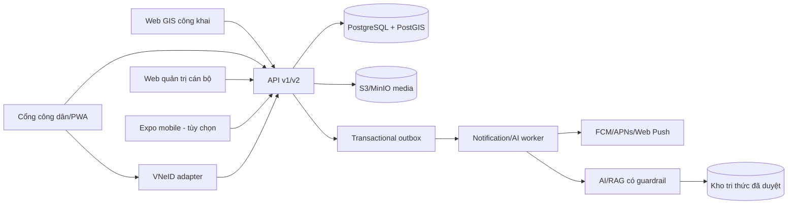

# Kế hoạch tích hợp 6 tính năng - Bản đồ số Cảnh sát khu vực

Ngày lập: 2026-08-25
Phạm vi: bản web hiện tại, API/PostGIS canonical, web quản trị cán bộ và khả năng
duy trì ứng dụng Expo như một client dùng chung API.

## 1. Kết luận điều hành

Sản phẩm hiện đã có vertical slice chạy trên dữ liệu thật cho tính năng 1:

- GPS hoặc điểm chọn trên bản đồ -> PostGIS xác định địa bàn;
- trả danh sách đầu mối, trụ sở, số gọi và ranh giới;
- 124 địa bàn, 124 polygon, 136 đơn vị, 126 trụ sở, 296 đầu mối và 34 hotline;
- browser chỉ gọi API, không đọc/ghi Firestore trực tiếp.

Dữ liệu hiện tại chưa đủ để tuyên bố hoàn thành toàn bộ tính năng 1 ở cấp cán bộ:
chưa có polygon khu vực phụ trách riêng khi một địa bàn có nhiều CSKV, cấp bậc và
vai trò chưa được chuẩn hóa đầy đủ, phần lớn trụ sở chưa có tọa độ chính thức, hai
đồn KCN 24647/24648 còn thiếu địa chỉ và geometry.

Năm tính năng còn lại cần thêm dữ liệu nghiệp vụ, xác thực VNeID, RBAC theo địa
bàn, object storage, thông báo, audit log và web quản trị. Không đưa phản ánh, SOS
hoặc dữ liệu nghiệp vụ vào khu vực Web GIS công khai.

## 2. Kiến trúc đích

### Ba bề mặt người dùng

1. **Web GIS công khai**: bản đồ lực lượng, trụ sở, hotline và cảnh báo đã ẩn danh;
   không cần đăng nhập, không hiển thị dữ liệu vụ việc thô.
2. **Cổng công dân/PWA**: đăng nhập VNeID, phản ánh, SOS, theo dõi trạng thái,
   đánh giá và trợ lý ảo. Có thể dùng responsive web trước, đóng gói mobile sau.
3. **Web quản trị cán bộ**: duyệt cảnh báo công khai, tiếp nhận/phân công vụ việc,
   xác minh gợi ý AI, cập nhật trạng thái, quản lý tri thức và dashboard KPI.

### Nguyên tắc kỹ thuật

- PostGIS/API là nguồn canonical; dừng mọi luồng client đọc/ghi Firestore.
- Public data và nghiệp vụ tách endpoint, schema response, quyền và cache.
- RBAC kết hợp phạm vi địa bàn: công dân, CSKV, chỉ huy, biên tập cảnh báo,
  quản trị viên và kiểm toán viên.
- Mọi thay đổi nghiệp vụ có audit log bất biến; media dùng URL ký ngắn hạn.
- AI chỉ đề xuất; người gửi xác nhận nội dung điền trước và cán bộ xác nhận phân
  loại/chuyển tuyến. Không để AI kết luận vụ việc.
- MVP dùng transactional outbox + worker; chỉ thêm RabbitMQ/Kafka khi đo được nhu
  cầu tải, tránh vận hành hạ tầng sự kiện quá sớm.

## 3. Kế hoạch theo sáu tính năng

### 3.1. Bản đồ số lực lượng và trụ sở

**Hiện trạng:** đã có MVP web/API/PostGIS với dữ liệu thật ở cấp xã/phường.

**Cần bổ sung**

- `officer_assignments`: cán bộ, đơn vị, địa bàn, thời gian hiệu lực, trạng thái.
- `service_areas`: polygon khu vực phụ trách chi tiết khi một xã/phường có nhiều
  cán bộ; có lịch sử phiên bản và người phê duyệt.
- Công cụ quản trị để xác minh cấp bậc, chức danh, số công khai, tọa độ trụ sở và
  hai đồn KCN.
- Deep link theo mã địa bàn, chia sẻ kết quả, danh sách thay thế khi bản đồ lỗi.
- Cache public response và version/ETag cho GeoJSON.

**API**

- Giữ `GET /v1/lookup/by-location`, `/by-code`, `/areas`, `/hotlines`.
- Thêm `GET /v1/stations/nearby`, `GET /v1/areas/:code/officers`.
- Admin: import/duyệt officer assignment, station coordinate và service area.

**Definition of Done**

- Bộ test điểm nằm trong, trên biên và ngoài polygon đều trả kết quả xác định.
- Không trả đầu mối hết hiệu lực hoặc trường không nằm trong public whitelist.
- Có bản ghi provenance/phê duyệt cho mọi số điện thoại và geometry công khai.
- Hai đồn KCN không xuất hiện trên bản đồ cho đến khi địa chỉ/toạ độ được duyệt.

### 3.2. Cảnh báo ANTT theo khu vực

**Dữ liệu mới**

- `alert_categories`: ANTT, giao thông, cháy nổ và danh mục được phê duyệt.
- `public_alerts`: tiêu đề, tóm tắt đã ẩn danh, geometry, mức độ, thời gian hiệu
  lực, trạng thái draft/review/published/expired, đơn vị tạo và người duyệt.
- Không ánh xạ trực tiếp một vụ việc nhạy cảm sang cảnh báo công khai.

**Luồng**

1. Cán bộ tạo bản nháp từ thông tin đã được phép công khai.
2. Người có quyền duyệt kiểm tra ẩn danh và thời hạn.
3. Worker phát hành, hết hạn tự động và gửi notification theo vùng quan tâm.
4. Web tải theo `bbox`, category và time window; hiển thị icon/cluster/pop-up.

**API/UI**

- Public: `GET /v1/alerts?bbox=&category=&activeAt=`.
- Admin: CRUD draft, submit review, approve/reject, publish/unpublish.
- Legend, bộ lọc, popup dễ đọc; icon không chỉ phân biệt bằng màu.

**Definition of Done**

- Chỉ trạng thái `published`, còn hiệu lực và `visibility=public` đi ra API.
- Kiểm thử tự động phát hiện số điện thoại, CCCD, tên cá nhân trong nội dung công
  khai; bước duyệt con người vẫn bắt buộc.
- Bản đồ hoạt động khi tile nền lỗi; cảnh báo và polygon vẫn đọc được.

### 3.3. Phản ánh sự việc hai chiều

**Dữ liệu mới**

- `incident_reports`, `incident_media`, `incident_status_history`.
- `incident_assignments`, `report_clusters`, `classification_predictions`.
- Trạng thái đề xuất: draft -> submitted -> received -> verifying -> processing ->
  resolved/rejected/closed; mọi chuyển trạng thái có actor, thời gian và lý do.

**Luồng công dân**

1. Xác thực VNeID.
2. Nhập văn bản/giọng nói/ảnh; upload trực tiếp object storage bằng URL ký.
3. AI trích thời gian, địa điểm, loại sự việc và nội dung chính.
4. Người dân kiểm tra/sửa rồi mới gửi.
5. PostGIS xác định địa bàn; rule engine chọn đơn vị/CSKV.
6. Cán bộ tiếp nhận, cập nhật; công dân theo dõi timeline và nhận thông báo.

**AI giai đoạn đầu**

- Rule + embedding để tìm phản ánh gần nhau theo không gian, thời gian, ngữ nghĩa.
- Lưu prediction, confidence, model version và quyết định cán bộ để đánh giá.
- Không tự gộp/xóa phản ánh gốc; chỉ tạo cluster tham chiếu.

**API**

- Citizen: tạo draft, upload media, submit, xem danh sách/chi tiết/timeline.
- Officer: inbox theo địa bàn, claim/assign, đổi trạng thái, ghi chú nội bộ.
- Worker: classify, deduplicate, notify; endpoint nội bộ phải idempotent.

**Definition of Done**

- Công dân chỉ xem phản ánh của mình; cán bộ chỉ xem phạm vi được phân quyền.
- Media private, mã hóa và dùng signed URL; có retention policy.
- Mọi phản ánh có receipt ID và lịch sử xử lý không thể sửa ngược.
- AI chưa đạt ngưỡng trên tập dữ liệu đã gán nhãn thì chỉ chạy shadow mode.

### 3.4. SOS khẩn cấp có VNeID

SOS là đường xử lý riêng, không phải một nút tạo phản ánh thông thường.

**Dữ liệu mới**

- `sos_events`, `sos_locations`, `sos_dispatches`, `sos_acknowledgements`.
- Lưu trạng thái kích hoạt, địa bàn, đơn vị nhận, thời điểm acknowledge, đóng sự
  kiện và reason code; audit đầy đủ.

**Luồng**

1. Người dùng đã VNeID chọn lĩnh vực hỗ trợ.
2. UI giữ/nhấn xác nhận để giảm chạm nhầm, hiển thị dữ liệu sẽ gửi.
3. Gửi idempotency key + vị trí/độ chính xác + device timestamp.
4. API kiểm tra rate limit, xác định địa bàn và trực ban/CSKV đang hiệu lực.
5. Tạo SOS trong một transaction, ghi outbox và phản hồi receipt ngay.
6. Nhiều kênh cảnh báo; cán bộ acknowledge, chuyển tuyến và cập nhật kết quả.

**Điều kiện go-live bắt buộc**

- Có tài liệu/kết nối VNeID chính thức, danh sách trực ban và SOP phản ứng được
  Công an tỉnh phê duyệt.
- Diễn tập sandbox các trường hợp mất mạng, gửi lặp, GPS sai, đơn vị không phản
  hồi và chuyển tuyến.
- Có giám sát 24/7, cảnh báo hàng đợi, backup/restore và runbook sự cố.
- Trước khi đủ điều kiện, chỉ cho phép chế độ mô phỏng có nhãn rõ; tuyệt đối không
  trình diễn như SOS thật.

### 3.5. Đánh giá hai chiều và KPI

Trong phạm vi tài liệu, “hai chiều” được triển khai an toàn theo hai nguồn đánh
giá, không xây dựng điểm tín nhiệm công khai cho công dân:

- Công dân đánh giá ứng dụng và chất lượng phục vụ sau khi vụ việc đóng.
- Chỉ huy/QA nội bộ đánh giá chất lượng quy trình xử lý và tuân thủ SLA.

**Dữ liệu/API/UI**

- `feedback`: target application/service, report ID, dimensions, score, comment,
  consent, moderation status; một đánh giá hợp lệ cho mỗi target/case/user.
- `service_kpi_daily`: aggregate theo đơn vị/thời gian, không lưu như nguồn sự thật.
- Citizen: form ngắn sau khi đóng; Officer/Admin: dashboard aggregate và drill-down
  có quyền, không công khai xếp hạng cá nhân.

**Definition of Done**

- Chỉ mời đánh giá sau trạng thái đủ điều kiện; chống gửi lặp.
- Dashboard ẩn danh khi mẫu quá nhỏ; comment nhạy cảm không xuất public.
- KPI tính lại được từ dữ liệu gốc và có định nghĩa/version rõ ràng.

### 3.6. Trợ lý ảo AI

**Phạm vi MVP**

- Hỏi đáp thủ tục hành chính, cách trình báo và hướng dẫn sử dụng.
- Tra cứu địa bàn, đơn vị, trụ sở và CSKV qua tool/API có cấu trúc.
- Hỗ trợ điền phản ánh nhưng không tự gửi.

**Dữ liệu và kiến trúc**

- `knowledge_documents`, `knowledge_versions`, `knowledge_chunks`.
- `chat_sessions`, `chat_messages`, `ai_runs`, `ai_feedback`.
- Chỉ index tài liệu đã duyệt, có hiệu lực; mỗi câu trả lời có nguồn/version.
- RAG guardrail: từ chối suy đoán vụ án, không kết luận pháp lý/nghiệp vụ, không
  tiết lộ dữ liệu ngoài quyền; chuyển sang hotline/cán bộ khi khẩn cấp.

**Definition of Done**

- Bộ câu hỏi vàng do nghiệp vụ duyệt; đo groundedness, citation correctness,
  refusal và tool-call accuracy.
- Không có nguồn phù hợp thì nói không biết và hướng dẫn kênh chính thức.
- Log prompt/output được giảm thiểu PII, có retention và quyền truy cập.
- Mọi thay đổi tài liệu phải re-index theo version và rollback được.

## 4. Nền tảng dùng chung phải làm trước

### Migration database tiếp theo

1. `003_service_areas.sql` + `004_xuan_huong_old_wards.sql`: đã tạo lớp 5 phường
   cũ dạng tham chiếu; chưa phải assignment CSKV chính thức.
2. `005_identity_rbac_audit.sql`: users, external identities, roles, scopes, audit.
3. `006_service_area_assignments_alerts.sql`: assignment được duyệt và public alerts.
4. `007_incidents_media.sql`: phản ánh, media, timeline, assignment, cluster.
5. `008_sos_outbox_notifications.sql`: SOS, outbox, devices, notification delivery.
6. `009_feedback_kpi.sql`: feedback và materialized/derived KPI.
7. `010_knowledge_chat_ai.sql`: knowledge/version/chunk, chat, AI run/evaluation.

Mỗi migration có down/restore plan, constraint, index địa lý/thời gian, dữ liệu
seed tối thiểu và test quyền truy cập.

### Dịch vụ nền

- VNeID adapter sau một interface; local/test dùng mock issuer có nhãn rõ.
- OpenAPI/JSON Schema làm contract cho web, admin, mobile và worker.
- Object storage private, antivirus/content validation, thumbnail/transcode worker.
- Transactional outbox, retry có backoff, dead-letter và idempotency.
- Web Push trước cho web; FCM/APNs khi duy trì/ra mắt mobile.
- Structured log, tracing, metrics, audit, backup và restore drill.

## 5. Lộ trình 16 tuần

Giả định đội tối thiểu: 2 backend/GIS, 2 web/mobile, 1 data/AI, 1 QA/DevSecOps và
đầu mối nghiệp vụ tham gia duyệt hằng tuần. Nếu chỉ có 2-3 kỹ sư, dự kiến 24-28
tuần và không nên chạy song song SOS với phản ánh.

| Tuần | Giai đoạn | Kết quả chạy được |
| --- | --- | --- |
| 1-2 | Nền tảng an toàn | Contract API, identity adapter, RBAC/area scope, audit, outbox, MinIO local, admin shell |
| 3-4 | Hoàn thiện tính năng 1 | Dữ liệu cán bộ/service area/trụ sở có phê duyệt; mobile bỏ Firestore trực tiếp; regression GIS |
| 3-5 | Tính năng 2 song song | Admin tạo-duyệt cảnh báo; Web GIS icon/filter/popup và expiry worker |
| 5-8 | Tính năng 3 | Citizen report, media, assignment, officer inbox, timeline, notification; AI chạy shadow |
| 8-10 | Tính năng 4 sandbox | SOS idempotent, dispatch/ack/escalation, diễn tập; chưa go-live nếu thiếu VNeID/SOP |
| 10-11 | Tính năng 5 | Form đánh giá sau đóng, dashboard KPI aggregate, privacy threshold |
| 11-14 | Tính năng 6 + AI hoàn thiện | Kho tri thức duyệt, chatbot có nguồn, AI prefill/dedupe/classify có evaluation |
| 15-16 | Pilot gate | Pen-test, load/chaos, restore drill, accessibility, UAT nghiệp vụ, runbook và quyết định go-live |

## 6. Đường găng và dữ liệu phải được cấp

| Phụ thuộc | Chặn tính năng | Yêu cầu trước khi triển khai thật |
| --- | --- | --- |
| VNeID credentials/tài liệu chính thức | 3, 4, 5 | Client registration, redirect/logout, token validation, môi trường sandbox, quy định thuộc tính được dùng |
| Danh sách cán bộ và phạm vi hiệu lực được phê duyệt | 1, 3, 4 | Cấp bậc/chức danh/số public, service area, trực ban, lịch sử điều chuyển |
| Dữ liệu cảnh báo được phép công khai | 2 | Taxonomy, mức độ, nội dung mẫu, quy trình ẩn danh và người duyệt |
| SOP tiếp nhận/chuyển tuyến/SLA | 3, 4, 5 | State machine, trách nhiệm, timeout/escalation, đóng/mở lại vụ việc |
| Kho thủ tục/tài liệu đã duyệt | 6 | Chủ sở hữu, version, ngày hiệu lực/hết hiệu lực, quyền công khai |
| Chính sách dữ liệu cá nhân/media | 3, 4, 5, 6 | Consent, retention, quyền xóa/truy cập, nơi lưu trữ, mã hóa và audit |

Không bắt đầu tích hợp production VNeID hoặc SOS thật bằng cách đoán contract.
Trong lúc chờ, phát triển qua adapter + mock sandbox và giữ feature flag tắt.

## 7. Chiến lược kiểm thử và chỉ số phát hành

### Test bắt buộc

- Unit/contract test cho state machine, RBAC, assignment và idempotency.
- PostGIS integration test: point-in-polygon, boundary, service-area precedence.
- E2E theo vai trò: public, citizen, CSKV, supervisor, admin.
- Security: IDOR/tenant-area escape, upload độc hại, rate limit, token replay,
  secrets scan và dependency scan.
- Load: tra cứu public, nhiều phản ánh cùng điểm, burst SOS và notification retry.
- AI evaluation trên tập có nhãn; kết quả chưa đạt gate chỉ chạy shadow mode.
- Accessibility WCAG AA cho public/citizen web; bàn phím và screen reader.

### SLO/KPI đề xuất cho pilot

- Public lookup p95 dưới 500 ms khi API/cache ổn định.
- 100% SOS có receipt, audit trail và trạng thái dispatch/ack; không mất sự kiện
  trong thử nghiệm retry/failover.
- 0 trường PII bị phát hiện trong API cảnh báo công khai của bộ test kiểm duyệt.
- 100% thay đổi trạng thái phản ánh có actor/time/reason và notification outcome.
- Độ chính xác AI không chốt bằng cảm tính: đặt gate sau khi nghiệp vụ duyệt tập
  test và ngưỡng cho từng tác vụ; luôn đo cả false positive/false negative.

## 8. Backlog 10 ngày đầu

1. Chốt public-field whitelist cho CSKV/trụ sở/cảnh báo và xử lý hai đồn KCN.
2. Chốt state machine phản ánh, SOS, role matrix và area-scope matrix.
3. Viết migration 003, OpenAPI auth/error/idempotency và audit middleware.
4. Dựng MinIO local, signed upload, content validation và retention metadata.
5. Tạo VNeID adapter + mock issuer có banner sandbox; lập danh sách thông tin cần
   phía VNeID/Công an tỉnh cấp.
6. Tạo admin shell và luồng duyệt dữ liệu tính năng 1.
7. Viết migration 004 và vertical slice cảnh báo draft -> approve -> public map.
8. Chuyển Expo services từ Firestore sang API client dùng chung; khóa đường ghi
   Firestore trên client.
9. Bổ sung test matrix PostGIS/RBAC/audit và CI cho migration + API + web.
10. Demo cuối ngày 10: dữ liệu lực lượng được duyệt và một cảnh báo ẩn danh đi
    trọn admin -> API -> Web GIS, có audit và tự hết hạn.

## 9. Thứ tự ưu tiên khuyến nghị

1. Hoàn thiện và kiểm duyệt tính năng 1.
2. Làm tính năng 2 để tạo giá trị public mà chưa phụ thuộc VNeID.
3. Xây nền tảng VNeID/RBAC/media rồi làm tính năng 3.
4. Chỉ làm SOS sau khi luồng phản ánh, on-call roster và audit đã ổn định.
5. Làm đánh giá sau khi có vòng đời vụ việc đóng.
6. Trợ lý AI có thể dựng sớm ở chế độ nội bộ, nhưng chỉ public khi có kho tri thức
   đã duyệt và bộ evaluation đạt gate.

Thứ tự này giữ sản phẩm luôn có phiên bản chạy được, đồng thời tránh đưa tính
năng rủi ro cao (SOS, VNeID, AI nghiệp vụ) lên trước khi có dữ liệu, SOP và quyền
phê duyệt cần thiết.

## 10. Điều chỉnh sau góp ý vòng 1

Chi tiết truy vết nằm tại `docs/feedback-integration-matrix.md`. Các quyết định đã
được chốt thêm:

- Public API không trả danh sách cán bộ toàn địa bàn. Mỗi kết quả chỉ có một đầu
  mối ưu tiên đã ẩn tên/cấp bậc; UI không hiển thị số điện thoại thành văn bản.
- Bản demo dùng bán kính tra cứu 3 km, lớp cảnh báo mẫu có nhãn và Google Maps cho
  chỉ đường. Không tự xây routing engine trong giai đoạn này.
- OTP được phép dùng qua mock identity adapter ở vòng 1; production vẫn giữ VNeID
  là gate cho phản ánh, SOS và đánh giá.
- SOS chỉ chạy sandbox cho đến khi có SOP, roster và kênh acknowledge/escalation.
  Web hướng dẫn bật quyền GPS; Android native mới được mở cài đặt hệ thống.
- Admin/chỉ huy được triển khai theo mobile-first PWA với inbox, danh sách nhận
  việc và chuyển đơn vị; không coi dashboard desktop co nhỏ là hoàn thành.
- Không làm giả GPS bằng cách tự nhảy Xuân Hương. Chế độ demo phải do người dùng
  bấm chọn và luôn có banner. Polygon demo cũng phải có `is_demo`, nguồn và người
  duyệt, không chia ngẫu nhiên rồi trộn vào dữ liệu canonical.
- Chatbot vòng 1 chỉ có layout; không sinh câu trả lời giả. AI thật phải có nguồn,
  version tài liệu, guardrail và evaluation như mục 3.6.
